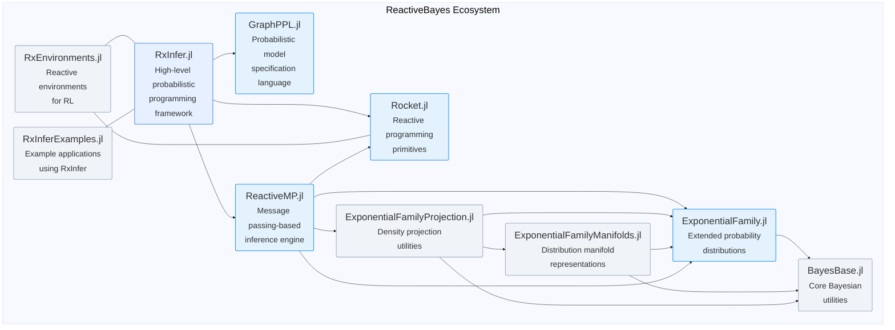

# Reactive Bayes

Open source software for reactive, efficient and scalable Bayesian inference.

Welcome to the Reactive Bayes organization! We develop and maintain a suite of Julia packages for probabilistic programming and Bayesian inference with a focus on reactive and message-passing based inference algorithms.

## Key Packages

- **[RxInfer](https://github.com/ReactiveBayes/RxInfer.jl)**
The central high-level probabilistic programming framework that enables reactive Bayesian inference on factor graphs through reactive message passing. It integrates tools including [probabilistic graphical model definition](https://github.com/ReactiveBayes/GraphPPL.jl) and [reactive message-based Bayesian inference](https://github.com/ReactiveBayes/ReactiveMP.jl).
- **[ReactiveMP](https://github.com/ReactiveBayes/ReactiveMP.jl)**
An efficient message passing-based Bayesian inference engine that implements the core algorithms and rules for performing high-performance, reactive message passing on factor graphs.
- **[GraphPPL](https://github.com/ReactiveBayes/GraphPPL.jl)**
A probabilistic programming language for specifying probabilistic graphical models as factor graphs. It provides a high-level domain-specific language for model creation and works seamlessly with RxInfer for inference.
- **[ExponentialFamily](https://github.com/ReactiveBayes/ExponentialFamily.jl)**
Extends [Distributions.jl](https://github.com/JuliaStats/Distributions.jl) with comprehensive implementations of a collection of exponential family distributions.
- **[Rocket](https://github.com/ReactiveBayes/Rocket.jl)**
A reactive programming framework providing core primitives for event handling and streaming for Julia, inspired by [RxJS](https://github.com/ReactiveX/rxjs). It forms the backbone for reactive computations in the ecosystem.

## Supporting Packages

- **[ExponentialFamilyManifolds](https://github.com/ReactiveBayes/ExponentialFamilyManifolds.jl)**
Provides manifold representations of exponential family distributions, enabling advanced optimization workflows with [Manopt.jl](https://github.com/JuliaManifolds/Manopt.jl). It facilitates efficient parameter tuning in natural parameter spaces.

- **[ExponentialFamilyProjection](https://github.com/ReactiveBayes/ExponentialFamilyProjection.jl)**
Enables projection of (un-normalized) log probability density functions onto exponential family distributions. It uses optimization techniques from [Manopt.jl](https://github.com/JuliaManifolds/Manopt.jl) and leverages [ExponentialFamilyManifolds.jl](https://github.com/ReactiveBayes/ExponentialFamilyManifolds.jl).

- **[BayesBase](https://github.com/ReactiveBayes/BayesBase.jl)**
Defines and re-exports core methods and utilities for Bayesian computation. It provides a shared foundation for the Reactive Bayes ecosystem.

## Application specific packages

- **[RxInferExamples](https://github.com/ReactiveBayes/RxInferExamples.jl)**
Contains example applications using RxInfer.
- **[RxEnvironments](https://github.com/ReactiveBayes/RxEnvironments.jl)**
Provides reactive environments for agents.

Our packages are designed to work together seamlessly to provide:

- **Reactive Inference**: Real-time updates as new data arrives
- **Message Passing**: Efficient inference through local computations
- **Scalability**: Handle large models and datasets
- **Flexibility**: Mix and match components for your specific needs

We welcome contributions from the community! Check out our individual package repositories for more details on how to get involved.
